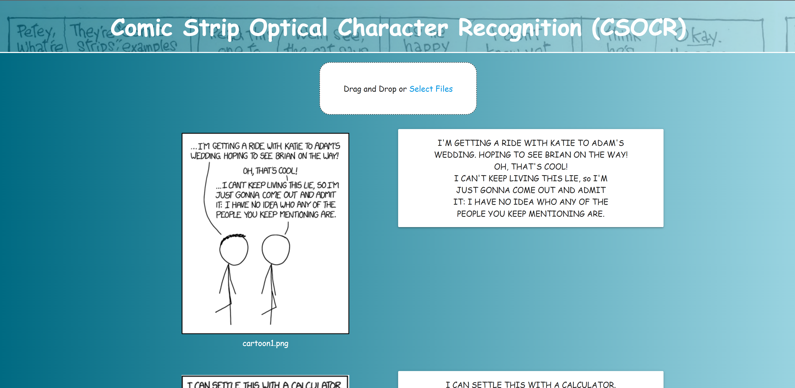

# Comic Strip Optical Character Recognition (CSOCR)
This program uses Dash and Materialize (CSS) to show a webpage where users can
upload one or more images that have text. The application will extract the text
from the images and display the images along with their extracted text in
addition to ordering them sequentially.

Dash is a Python library created by Plotly which uses React.js and Plotly.js to
make a Flask application. Materialize is a front-end framework developed by
Google, used here to make a simplistic website. Other libraries used include
base64, boto3, and gensim.

The inputted image files are encoded in Base64, so we decode these and then use
Amazon's Textract to read the text. As for ordering the various comic strip
segments, the segments are fed through Google's Word2Vec model and ordered by
the Word Mover's Distance. This works by comparing the word encodings of the
segments found in the pre-trained model. Overall, the HTML elements are
dynamically generated and ordered to be inserted into the application's layout.

